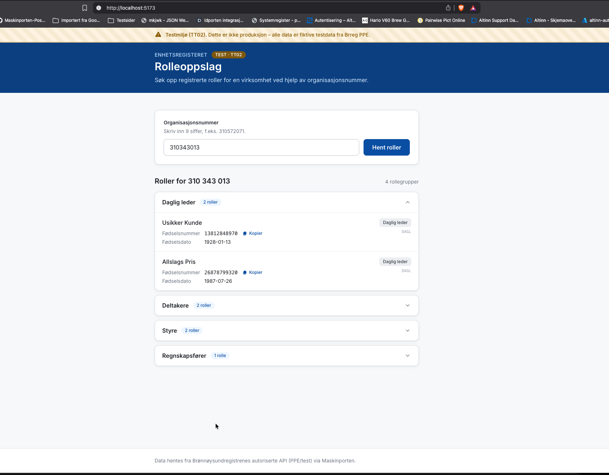

# Rolleoppslag – Enhetsregisteret (Brreg) via Maskinporten

Enkel webapp som henter registrerte roller for en virksomhet
(organisasjonsnummer) fra Brønnøysundregistrenes **autoriserte API** (PPE/test).

- **Frontend:** React + Vite + Tailwind CSS, designet etter prinsippene i
  [Digdir Designsystemet](https://designsystemet.no/).
- **Backend (BFF):** Node.js + Express. Utfører Maskinporten-autentisering
  (JWT-bearer grant) og det autoriserte kallet mot Brreg. Den private JWK-en
  forlater aldri serveren.

## Slik ser det ut



> Appen kjører mot testmiljøet (TT02 / Brreg PPE) – alle data er fiktive testdata.

## Struktur

```
rolleoppslag-breg/
├─ server/   # Express BFF – Maskinporten + Brreg
└─ client/   # React-app (Vite)
```

## Kom i gang (lokalt)

Krever **Node.js 20+** (testet på Node 22).

```bash
# 1. Installer alt (npm workspaces)
npm install

# 2. Konfigurer hemmeligheter
cp server/.env.example server/.env
#   Fyll inn MASKINPORTEN_CLIENT_ID og MASKINPORTEN_JWK i server/.env

# 3. Start både server (3001) og frontend (5173)
npm run dev
```

Åpne <http://localhost:5173>. Frontend proxyer `/api`-kall til BFF-en.

### Test det

Bruk et testorganisasjonsnummer fra TT02, f.eks. **`310343013`**, og trykk
«Hent roller». Du skal da se rollegrupper med fiktive testpersoner (navn,
fødselsnummer og fødselsdato).

## Miljøvariabler (`server/.env`)

| Variabel | Påkrevd | Standard |
| --- | --- | --- |
| `MASKINPORTEN_CLIENT_ID` | ja | – |
| `MASKINPORTEN_JWK` | ja | – (hele JWK som JSON på én linje) |
| `MASKINPORTEN_TOKEN_ENDPOINT` | nei | `https://test.maskinporten.no/token` |
| `MASKINPORTEN_AUDIENCE` | nei | `https://test.maskinporten.no/` |
| `MASKINPORTEN_SCOPE` | nei | `brreg:data:enhetsregisteret:auto:roller` |
| `MASKINPORTEN_RESOURCE` | nei | `https://data.ppe.brreg.no/enhetsregisteret/autorisert-api` |
| `BRREG_BASE_URL` | nei | `https://data.ppe.brreg.no/enhetsregisteret/autorisert-api` |
| `PORT` | nei | `3001` |

## Hosting / produksjon

- Bygg frontend: `npm run build` → statiske filer i `client/dist/`.
- Kjør BFF: `npm start` (krever `server/.env`).
- BFF-en kan enten serveres bak samme domene som frontend (anbefalt – sett en
  reverse proxy som ruter `/api` til Express), eller frontend og backend kan
  deployes hver for seg så lenge `/api` rutes til BFF-en.
- Hemmeligheter (`MASKINPORTEN_JWK`, `MASKINPORTEN_CLIENT_ID`) bør settes som
  miljøvariabler i hosting-plattformen, ikke sjekkes inn i git.

## API

`GET /api/roller/:orgnr` – 9 siffer. Returnerer Brreg sin rollerespons, eller
en feilmelding (`400` ugyldig orgnr, `404` ikke funnet, `502` Brreg-feil).
